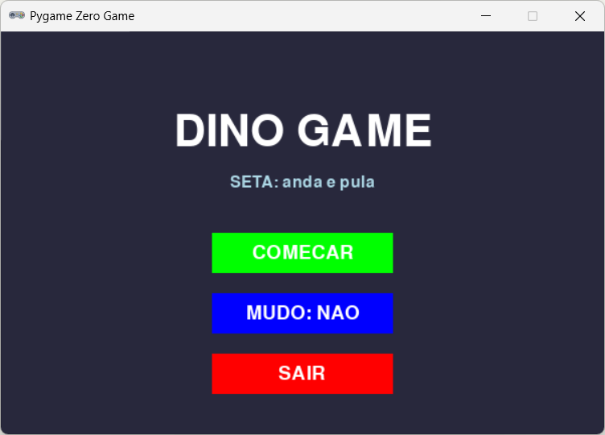
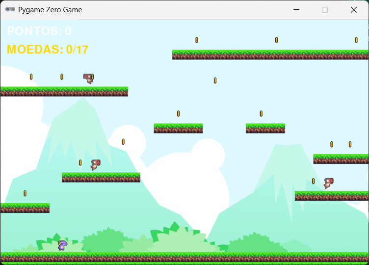
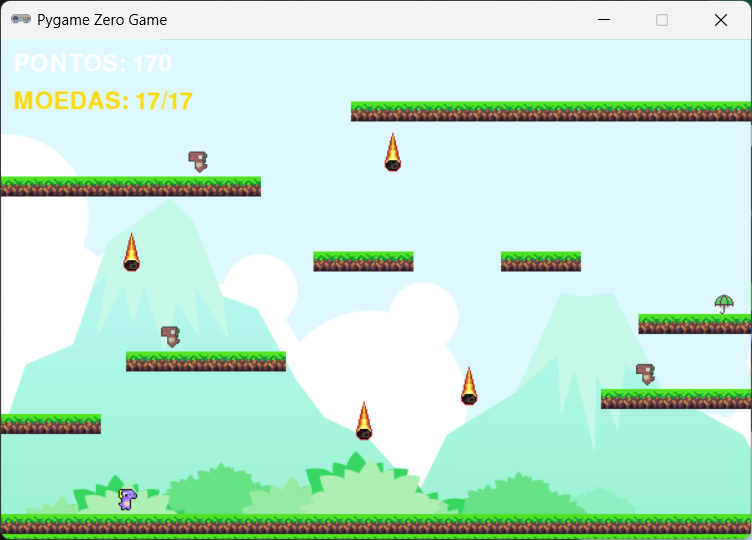
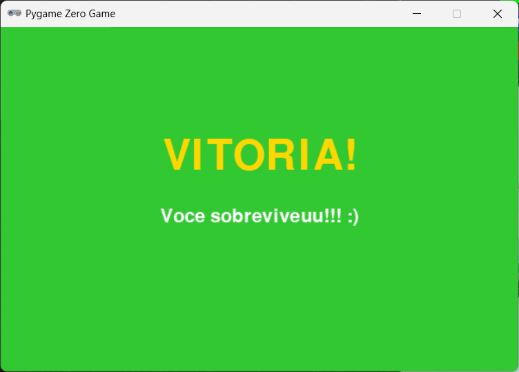

# Dino Platformer Game

Um jogo de plataforma 2D feito em Python usando o **Mu Editor** e a biblioteca **PgZero**.

<div align="center">
  
  
  <br>
  
  
  <br>
  <em>Menu - Coleta de Moedas - Meteoros - Vitória</em>
</div>


## 📋 Requisitos

- Python 3.8 ou superior
- Mu Editor (recomendado) ou qualquer IDE Python
- Biblioteca PgZero

## 🚀 Como Instalar e Executar

### 1. Instalar o Mu Editor
- Baixe o Mu Editor em: https://codewith.mu
- Instale normalmente no seu sistema

### 2. Instalar PgZero
No Mu Editor, já vem com PgZero instalado. Se estiver usando outro editor:

```bash
pip install pgzero
```

### 3. Configurar o Projeto
1. Abra o Mu Editor
2. Crie uma nova pasta para o projeto
3. Coloque os arquivos:
   - `dino_game.py` (código principal)
   - Pasta `images/` com todas as imagens
   - Pasta `sounds/` com todos os sons

### 4. Estrutura de Arquivos
```
dino_game/
├── dino_game.py
├── images/
│   ├── idle1_right.png
│   ├── idle2_right.png
│   ├── ...
│   ├── run1_right.png
│   ├── ...
│   ├── enemy_walk1_left.png
│   ├── ...
│   ├── coin1.png
│   ├── ...
│   ├── grass.png
│   ├── bg.png
│   ├── meteoro.png
│   └── umbrella.png
└── sounds/
    ├── music.ogg
    ├── jump.wav
    ├── coin.wav
    └── hurt.wav
```

### 5. Executar o Jogo
No Mu Editor:
- Clique no botão **"Run"** (ou F5)
- Ou no terminal: `python dino_game.py`

## 🎮 Como Jogar

### Controles:
- **Seta Direita/Esquerda**: Movimentar o personagem
- **Seta Para Cima**: Pular
- **ESC**: Voltar ao menu (durante o jogo)
- **Mouse**: Clicar nos botões do menu

### Objetivo:
1. Coletar todas as **moedas** espalhadas pelas plataformas
2. Depois de coletar todas moedas, **meteoros começam a cair**!!!
3. Chegar até o **guarda-chuva** (aparece após coletar todas moedas)
4. Pegue o guarda-chuva para vencer!

### Mecânicas:
- O personagem pode pular entre plataformas
- Inimigos andam de um lado para o outro
- Evite tocar nos inimigos e meteoros
- Moedas dão pontos

## 🛠️ Funcionalidades Implementadas

✅ **Menu Principal** com botões:
- Começar jogo
- Ligar/Desligar som
- Sair

✅ **Personagem** com animações:
- Animação idle (parado)
- Animação de corrida (6 frames)
- Movimento suave com física

✅ **Inimigos** que:
- Andam em território limitado
- Têm animação de caminhada
- São perigosos ao toque

✅ **Sistema de Colecionáveis**:
- Moedas com animação giratória (12 frames)
- Sistema de pontuação
- Guarda-chuva como objetivo final

✅ **Efeitos Especiais**:
- Meteoros que caem após coletar todas moedas
- Sons para ações (pulo, moeda, dano)
- Música de fundo

✅ **Interface**:
- Contador de moedas e pontos
- Tela de vitória
- Limites de tela visíveis

## 📝 Notas Técnicas

### Bibliotecas Usadas:
- **PgZero**: Engine principal do jogo
- **Random**: Para posicionamento aleatório
- **Math**: Para cálculos matemáticos
- **Rect (do Pygame)**: Para colisões
  
### Arquivos de Imagem Necessários:
- **Personagem**: idle1-3_right/left.png, run1-6_right/left.png
- **Inimigo**: enemy_walk1-4_left/right.png
- **Moeda**: coin1-12.png
- **Cenário**: grass.png, bg.png, meteoro.png, umbrella.png

### Arquivos de Som Necessários:
- **music.ogg**: Música de fundo
- **jump.wav**: Som de pulo
- **coin.wav**: Som de coleta de moeda
- **hurt.wav**: Som de dano

## 📄 Licença

Este projeto foi desenvolvido para fins educacionais. Sinta-se livre para modificar e aprender com o código!


Desenvolvido como projeto prático de Python.
